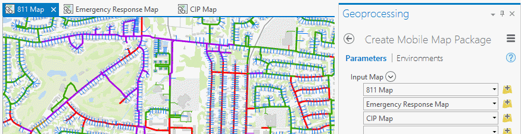
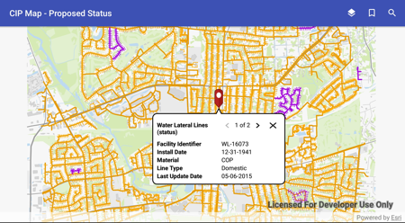
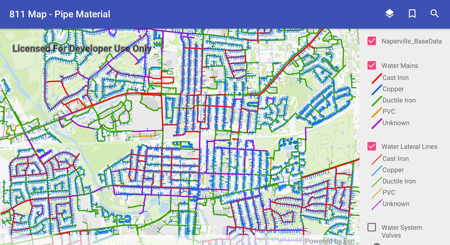
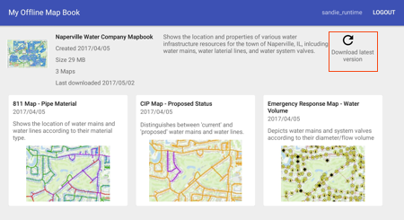

# Offline Mapbook

Create [mobile map packages](http://pro.arcgis.com/en/pro-app/help/sharing/overview/mobile-map-package.htm) with [ArcGIS Pro](http://pro.arcgis.com/en/pro-app/help/sharing/overview/mobile-map-package.htm#ESRI_SECTION1_1E51ECF0BC1741DAA3EB6F9FF671FA35) and use your maps offline using the [ArcGIS Runtime SDKs](https://developers.arcgis.com/arcgis-runtime/)!

## Description 

Learn how to create and share mobile map packages so that you can take your organization's maps offline and view them in the field with an Android app.  This example demonstrate how to:
 - Create and share a mobile map package
 - Download the mobile map package from an organization using authenticated access
 - Display a table of contents (TOC) and legend
 - Identify multiple features and display popup data with a ```Callout```
 - Search
 - Show bookmarks

## Data Preparation

Here we describe the steps for authoring and packaging the mobile map package used by the app. 
 This work was performed using ArcGIS Pro 1.4.1.

### Data scenario
In this example, an employee of the fictitious 'Naperville Water Company' requires offline access to the following types of data while out in the field:

- An 811 map displaying locations of water mains and lines that should be marked when citizens call '811'
- An emergency response map displaying locations of water valves and their associated mains that might need to be turned off in the case of an emergency leak
- A capital improvement project (CIP) map displaying locations of newly-proposed water mains and water lines that need to either be further assessed or established

The table below summarizes the layers within each map that are visible by default:

| Layer                   | 811 Map | Emergency Response Map | CIP Map |
|:------------------------|:-------:|:----------------------:|:-------:|
| **Water Lateral Lines** | X       |                        | X       |
| **Water Mains**         | X       | X                      | X       |
| **Water System Valves** |         | X                      |         |
| **Reference Backdrop**  | X       | X                      | X       |

### Authoring the data for viewing

#### Setting symbology
It was important that each map be made to look unique and effectively convey its purpose. In order to achieve this, field attributes were chosen that were most relevant to the map's intended goal and then symbolized using a unique value renderer. In many cases, this yielded multiple classes being represented per layer. The following table identifies the attribute chosen for each layer on a per-map basis.

| Layer                   | 811 Map       | Emergency Response Map | CIP Map         |
|:------------------------|:-------------:|:----------------------:|:---------------:|
| **Water Lateral Lines** | pipe material |                        | proposal status |
| **Water Mains**         | pipe material | pipe diameter          | proposal status |
| **Water System Valves** |               | valve type             |                 |

#### Creating a reference backdrop
To keep the mobile map package (.mmpk) as small as possible, the reference layer was packaged into a .vtpk or [vector tile package](http://pro.arcgis.com/en/pro-app/help/sharing/overview/vector-tile-package.htm) and used as basemap within each map. For more information about how to create a vector tile package, see the help topic for the [Create Vector Tile Package](http://pro.arcgis.com/en/pro-app/tool-reference/data-management/create-vector-tile-package.htm) geoprocessing tool.

#### Creating locators
The Offline Mapbook app supports geocoding and search so a [locator](http://desktop.arcgis.com/en/arcmap/10.3/guide-books/geocoding/essential-geocoding-vocabulary.htm) was built for each layer in the app by using the [Create Address Locator](http://pro.arcgis.com/en/pro-app/tool-reference/geocoding/create-address-locator.htm) geoprocessing tool once per layer. Most crucial to this part of the workflow was that 'General - Single Field' was chosen for the "Address Locator Style". This style is useful for allowing searching of the contents within a single field, which was sufficient for the purpose of app.

The following layers in the app are searchable:
- Water Lateral Lines
- Water Mains
- Water System Valves
- Address Points 

Once an address locator, or .loc file, is created for each layer, it was time to run the [Create Composite Address Locator](http://pro.arcgis.com/en/pro-app/tool-reference/geocoding/create-composite-address-locator.htm) geoprocessing tool. The Create Composite Locator tool allows multiple, individual .loc files to be specified as an input so that it can package the contents into a single resulting _composite_ .loc file. Worth noting is that a composite address locator does not store the address indexing information as would a standalone .loc file, but rather references the data from the input locators that are specified when it's generated. This composite locator (.loc) file was later specified when building the mobile map package.

#### Setting bookmarks
The Offline Mapbook app supports viewing of predefined, bookmarked locations. Two [bookmarks](http://pro.arcgis.com/en/pro-app/help/mapping/navigation/bookmarks.htm) were set in ArcGIS Pro for each map and are included in the mobile map package.

#### Metadata and thumbnails
Before finalizing the maps for publishing, metadata was created for each map. The Title and Summary properties for each map are accessed in ArcGIS Pro by opening the Map Properties window, double clicking the map title from the Contents pane, and clicking the Metadata tab within. Like the map title and summary, a map thumbnail can also provide context. The thumbnail image for a map can be generated in ArcGIS Pro by right clicking a map's title in the Contents pane and selecting 'Create Thumbnail' from the context menu that appears. The created thumbnail can be viewed by hovering the mouse cursor over the map from the Project pane under the 'Maps' section.

### Packaging for consumption
In order for this data to be consumed within the Mapbook app, it had to first be published as an .mmpk or ([mobile map package](http://pro.arcgis.com/en/pro-app/help/sharing/overview/mobile-map-package.htm)). An .mmpk file can either be hosted on a portal and downloaded automatically prior to running the app or, in this case, side-loaded onto the device and placed beside the app prior to running it. This subsection describes using the [Create Mobile Map Package](http://pro.arcgis.com/en/pro-app/tool-reference/data-management/create-mobile-map-package.htm) geoprocessing tool specifically for the purpose of packaging the data that was created for the Offline Mapbook app. 

#### Including multiple maps
Because multiple maps were authored to be used for the Offline Mapbook app, multiple maps had to be specified when running the Create Mobile Map Package tool. The first parameter of the tool is 'Input Map' and can accommodate for the specification of multiple entries. By default, each dropdown will present a list of maps that exist within the current ArcGIS Pro project. For this mobile-map-packaging, each of the three maps was specified once.



#### Including the locator
Although a mobile map package supports multiple input locators, we simplified this process by creating a single, composite locator which references the four source locators being used. Given that this is the case, only the composite locator needed to be specified within the tool. Alternatively, the extra step of creating the composite locator and instead specifying the individual locators as inputs to the tool will work as well.

### Sharing the mobile map package
Once the .mmpk file has been created, ArcGIS provides two possible mechanisms for making a mobile map package available within a Portal for ArcGIS or on ArcGIS Online.

#### Using the ArcGIS Pro 'Share Package' tool
The first method for getting a locally-saved mobile map package to a Portal for ArcGIS or on ArcGIS Online is to 'push' it using a dedicated geoprocessing tool. This tool, called the [Share Package](http://pro.arcgis.com/en/pro-app/tool-reference/data-management/share-package.htm) tool takes an input .mmpk file (as well as a host of other types of package files created using ArcGIS) and uploads it to the desired destination. In lieu of the tool requesting credentials, these are instead retrieved from ArcGIS Pro itself. Since the credentials passed in to the current session of Pro dictate the destination Portal to which the package will be shared, it's helpful to be aware of with which credentials you're logged in before running the tool!

#### Uploading directly from the 'My Content' page
The second method for getting a locally-saved mobile map package to a Portal for ArcGIS or on ArcGIS Online is to 'pull' it using the [Add Item](http://doc.arcgis.com/en/arcgis-online/share-maps/add-items.htm) tool. This can be found from the 'My Content' page and is as simple as browsing for the local file, providing a title and some tags, and clicking 'ADD ITEM'.

## App Developer Patterns
Now that the mobile map package has been created and published, it can be downloaded by the app using an authenticated connection.

### Authentication
When the mapbook app launches, it checks for the ```MobileMapPackage``` (.mmpk) on the device.  The app will attempt to download the mobile map package from [AGOL](https://arcgisruntime.maps.arcgis.com) and leverages the ArcGIS [identity](https://developers.arcgis.com/authentication/) to provide access to resources via the the [named user](https://developers.arcgis.com/authentication/#named-user-login) login pattern. The app prompts you for your organization’s ArcGIS Online credentials used to obtain a token later consumed by the Portal. The ArcGIS Runtime SDKs provide a simple to use API for dealing with ArcGIS logins.


1. A request is made to a secured resource.
2. The portal responds with an unauthorized access error.
3. A challenge handler associated with the identity manager is asked to provide a credential for the portal.
4. A UI displays and the user is prompted to enter a user name and password.
5. If the user is successfully authenticated, a credential (token) is included in requests to the secured service.
6. The identity manager stores the credential for this portal and all requests for secured content includes the token in the request.

The ```DefaultAuthenticationChallengeHandler``` class takes care of steps 1-6 in the diagram above. For an application to use this pattern, follow these [guides](https://developers.arcgis.com/authentication/signing-in-arcgis-online-users/) to register your app.
```java
// Add these four lines to your Android fragment or activity
OAuthConfiguration oAuthConfiguration = new OAuthConfiguration("https://www.arcgis.com",clientId, redirectUri);
DefaultAuthenticationChallengeHandler authenticationChallengeHandler = new DefaultAuthenticationChallengeHandler(this);
AuthenticationManager.setAuthenticationChallengeHandler(authenticationChallengeHandler);
AuthenticationManager.addOAuthConfiguration(oAuthConfiguration);
```

Anytime a secured service issues an authentication challenge, the ```DefaultAuthenticationChallengeHandler``` and the corresponding ```DefaultOAuthIntentReceiver``` work together to broker the authentication transaction. In addition to the two lines above, the Android manifest.xml file must define a ```DefaultOAuthIntentReceiver``` that receives intents once a user has entered their credentials.

```xml
<activity>
  android:name="com.esri.arcgisruntime.security.DefaultOAuthIntentReceiver"
  android:label="OAuthIntentReceiver"
  android:launchMode="singleTask">
  <intent-filter>
    <action android:name="android.intent.action.VIEW"/>
    <category android:name="android.intent.category.DEFAULT"/>
    <category android:name="android.intent.category.BROWSABLE"/>

    <data android:scheme="my-maps-app"/>
  </intent-filter>
</activity>
```
       
Note the value for android:scheme in the XML. This is [redirect URI](https://developers.arcgis.com/authentication/browser-based-user-logins/#configuring-a-redirect-uri) that you configured when you registered your app [here](https://developers.arcgis.com/). For more details on the user authorization flow, see the [Authorize REST API](http://resources.arcgis.com/en/help/arcgis-rest-api/#/Authorize/02r300000214000000/).

### Mobile Map Packages
The [```MobileMapPackage```](http://pro.arcgis.com/en/pro-app/help/sharing/overview/mobile-map-package.htm)  is downloaded from the ```Portal``` into the application-specific directory on the device.  The Naperville Water Company Mapbook  ```MobileMapPackage``` used in this app contains a locator and several maps. Each map contains a vector tile package representing base data, feature layers consisting of feature data about water systems and address points, and bookmarked viewpoints.  The ```MobileMapPackage``` must first be [loaded](https://developers.arcgis.com/android/latest/guide/loadable-pattern.htm) before metadata about the package can be displayed.


```java
MobileMapPackage mobileMapPackage = new MobileMapPackage(mmpkPath);

mobileMapPackage.addDoneLoadingListener(new Runnable() {

@Override public void run() {
    if (mobileMapPackage.getLoadStatus() == LoadStatus.LOADED) {
    
       // Show mapbook metadata like map thumbnails, 
       // mapbook size, mapbook modified dates, etc.
       
       showMapbook(mobileMapPackage);

       // Get the list of maps in the mobile map package
       List<ArcGISMap> maps = mobileMapPackage.getMaps();

    }else{
       // Mapbook didn't load
       handleLoadProblem();
    }
  }
});
mobileMapPackage.loadAsync();
```

### Identify
As the user taps on a map in the mapbook, the [identify](https://developers.arcgis.com/android/latest/guide/identify-features.htm) operation is used to retrieve all of the data for that location from the map's visible feature layers.  In this mobile map package, every map has multiple feature layers and so the method to identify features in all layers is used.  By extending the [```DefaultMapViewOnTouchListener```](https://developers.arcgis.com/android/latest/api-reference/reference/com/esri/arcgisruntime/mapping/view/DefaultMapViewOnTouchListener.html) and overriding the ```onSingleTapConfirmed``` method, the clicked location is used to identify features in the visible layers. 

```java

    /**
     * When a user taps on the map, an identify action is initiated and any features found are displayed in a callout view.
     * @param e - MotionEvent
     * @return boolean
     */
    
    @Override
    public boolean onSingleTapConfirmed(final MotionEvent e) {
      // get the screen point where user tapped
      android.graphics.Point screenPoint = new android.graphics.Point((int) e.getX(), (int) e.getY());

      ListenableFuture<List<IdentifyLayerResult>> identifyLayers = 
         mMapView.identifyLayersAsync(screenPoint,5d,true);

      identifyLayers.addDoneListener(new Runnable() {
        @Override
        public void run() {
          try {
         
            List<IdentifyLayerResult> results = identifyLayers.get();
  
            FeatureLayer featureLayer = null;
            
            // In this app, we only care about FeatureLayer results
            if (result.getLayerContent() instanceof FeatureLayer) {
                for (IdentifyLayerResult result : results){
                   featureLayer = (FeatureLayer) result.getLayerContent();
                   // a reference to the feature layer can be used, 
                   // for example, to select identified features
                   featureLayer.setSelectionWidth(3.0d); 
                }
            }         
 
          } catch (InterruptedException | ExecutionException ie) {
            handleError(ie);
          }
        }
      });

      return super.onSingleTapConfirmed(e);
    }

```
The API provides the ability to identify multiple layer types, with results being stored in ```Layer.getSubLayerContents```. Developers should note that if they choose to identify other layer types, like ```ArcGISMapImageLayer``` for example, they would need to add that implementation themselves.

### Displaying Identify Results 

Results of the identify action are displayed using ```Popup``` and ```Callout``` objects. 

#### Popups
The layers in this app have been configured using ArcGIS Pro to support [```PopUp```](https://developers.arcgis.com/android/latest/guide/essential-vocabulary.htm#GUID-F67C6CED-142A-498C-9CC2-3D14582DB0D3) objects.  The ```IdentifyLayerResult``` returns pop-up content that is customized for display in a ```Callout``` widget.

```java

List<IdentifyLayerResult> results = identifyLayers.get();
  
FeatureLayer featureLayer = null;
            
// In this app, we only care about FeatureLayer results
if (result.getLayerContent() instanceof FeatureLayer) {
    for (IdentifyLayerResult result : results){
    
    }
         List<Popup> popups = result.getPopups();
        
         // Iterate through all of the popups associated with the identified result
         for ( Popup popup : popups){ 
          
             // Use a PopupManager to get popup field names and values
             PopupManager mPopupManager = new PopupManager(mContext, popup);
             
             List<PopupField> fields = mPopupManager.getDisplayedFields();
             
             // Iterate over all the fields in the popup
             // and customize the content
             
             for (PopupField field : fields) {
                 Field.Type fieldType = mPopupManager.getFieldType(field);
                 Object fieldValue = mPopupManager.getFieldValue(field);
                 String fieldLabel = field.getLabel();
                 
                 buildCalloutContent(fieldValue, fieldLabel);
         }
    }
}
```
#### Callouts
The ```MapView's``` [Callout](https://developers.arcgis.com/android/latest/api-reference/reference/com/esri/arcgisruntime/mapping/view/Callout.html) widget is used to display details about the identified features.  A ```Callout``` displays an Android View that contains text and/or other content. The behavior of the ```Callout``` is managed by the ```MapView``` but the callout's style can be modified as needed using the [```Callout.Style```](https://developers.arcgis.com/android/latest/api-reference/reference/com/esri/arcgisruntime/mapping/view/Callout.Style.html) class.  [```CalloutOut.ShowOptions```](https://developers.arcgis.com/android/latest/api-reference/reference/com/esri/arcgisruntime/mapping/view/Callout.ShowOptions.html) can be configured to control ```Callout``` animation and centering behaviors.  The ```Callout``` is obtained from the ```MapView``` as shown below:

```java

// Get the callout from the MapView
Callout mCallout = mMapView.getCallout();

// Create a style for the Callout
callout.Style style = new Callout.Style(getContext());

// Optionally set the dimensions

style.setMinWidth(350);
style.setMaxWidth(350);

// Specify where to position the leader
style.setLeaderPosition(Callout.Style.LeaderPosition.UPPER_MIDDLE);

// Sets the location of the callout by specifying a Point in map coordinates. 
// This is the Point the callout leader points to.

mCallout.setLocation(resultPoint);

//The customView is a View you construct
// using your own version of "buildContentView()"

View customView = buildContentView();
mCallout.setContent(customView);

// Animate the display, but don't recenter the MapView when Callout is shown.
mCallout.setShowOptions(new Callout.ShowOptions(true,false,false));

mCallout.setStyle(style);

mCallout.show();
```



### TOC, Legend, and Bookmarks

Layer visibility can be toggled in the table of contents (TOC).  In addition to the layer name, a legend is also shown for each layer.  A set of nested RecyclerViews are used to display the TOC and legend, obtained from the map as [operational layers](https://developers.arcgis.com/android/latest/guide/layers.htm#ESRI_SECTION1_272346C9CB0049938539D5F8970624F2).
```java
// Get the list of Layer items from the map
List<Layer> layerList = map.getOperationalLayers();

// Assign the list to the MapLayerAdapter 
 mMapLayerAdapter.setLayerList(layerList);
 
...

// The layer name is assigned within the 
// onBindViewHolder method of the adapter

holder.layerName.setText(layer.getName());

// The MapLegendAdapter is also setup and assigned
// within MapLayerAdapter's onVindViewHolder method

MapLegendAdapter legendAdapter = new MapLegendAdapter(mContext);

holder.legendItems.setLayoutManager(new LinearLayoutManager (mContext));

holder.legendItems.setAdapter(legendAdapter);

// Retrieve any legend info from the FeatureLayer
if (layer instanceof FeatureLayer) {
      
    // Fetch legend data asynchronously
    ListenableFuture<List<LegendInfo>> legendInfoFuture = layer.fetchLegendInfosAsync();
      
    legendInfoFuture.addDoneListener(new Runnable() {
      @Override public void run() {
        try {
          List<LegendInfo> legendList = legendInfoFuture.get();
          legendAdapter.setLegendInfo(legendList);
          legendAdapter.notifyDataSetChanged();
        } catch (InterruptedException | ExecutionException e) {
          Log.e(TAG, e.getMessage());
         }
      }
    });
}

```


A ```Bookmark``` identifies a particular geographic location and time on an ArcGISMap.  In the mapbook app, the ```Bookmark``` name is displayed in a simple RecylerView and when clicked the ```MapView's``` viewpoint is updated with the bookmared viewpoint.

```java
mBookmarkAdapter = new MapBookmarkAdapter(new MapBookmarkAdapter.OnBookmarkClickListener() {
    @Override public void onItemClick(final Viewpoint viewpoint) {
        mMapView.setViewpoint(viewpoint);
    }
 });
```


### Suggestions & Search

Typing the first few letters of an address into the Mapbook search box (e.g. “123”) shows a number of matched suggestions.  This is accomplished by leveraging the suggest capability of the locator in the ```MobileMapPackage```.  The LocatorTask has various asynchronous methods that we use to provide address suggestions when searching for places or geocoding locations. The first step is to confirm that a ```MobileMapPackage``` contains a ```LocatorTask```.  If it does, be sure to query the  [```LocatorTask```](http://developers.arcgis.com/android/beta/guide/search-for-places-geocoding-.htm#ESRI_SECTION1_62AE6A47EB4B403ABBC72337A1255F8A) for ```LocatorInfo``` to ensure the locator supports suggestions.


```java

    LocatorTask mLocatorTask = mMobileMapPackage.getLocatorTask();

    // Make sure the mobile map package has a non-null LocatorTask
    if (mLocatorTask != null){

      // Attach a listener to the locator task since the LocatorTask may or may not be loaded the
      // the very first time a user types text into the search box.  If the Locator is already loaded,
      // the following listener is invoked immediately.

      mLocator.addDoneLoadingListener(new Runnable() {
        @Override
        public void run() {

          LocatorInfo locatorInfo = mLocatorTask.getLocatorInfo ();

          // Does the locator have suggestion support?
          if (locatorInfo.isSupportsSuggestions ()){

            ListenableFuture> suggestionsFuture = mLocator.suggestAsync(query, suggestParams);

            // Attach a done listener that executes upon completion of the async call

            suggestionsFuture.addDoneListener(new Runnable() {
              @Override
              public void run() {
                try {
                  // Get the suggestions returned from the locator task.
                  // Process and display

                } catch (Exception e) {
                  dealWithException(e);
                }
              }
            });
          }
        }
      });

      // Initiate the asynchronous call
      mLocator.loadAsync();
```


Once a suggestion is selected, the loaded ```LocatorTask``` uses [geocoding](https://developers.arcgis.com/android/beta/guide/search-for-places-geocoding-.htm#ESRI_SECTION1_406F4F35F62C465ABC52F3FF04BB6B04)  to transform an address or a place name to a specific geographic location. In this app, there is one predefined composite locator that searches all visible layers. 

```java

// Call geocodeAsync passing in an address
ListenableFuture<List<GeocodeResult>> geocodeFuture = mLocatorTask.geocodeAsync(address, mGeocodeParameters);

geocodeFuture.addDoneListener(new Runnable() {

    @Override public void run() {

        try {

            List<GeocodeResult> geocodeResults = geocodeFuture.get();
            showGeocodeResults(geocodeResuts);

        } catch (InterruptedException | ExecutionException e) {

           handleGeocodeError(e);
        }
     }
});
```

### Updating Mobile Map Package

Every time the app starts and there is a network connection, it will check for updates to the mobile map package by querying the Portal.  If a newer version of the mobile map pacakge is available, a refresh button will be displayed on the main page of the app.



When the app checks for updates, it uses decrypted credentials that have previously been encrypted.  Portal credentials get encrypted the very first time the Offline Mapbook mobile map package is downloaded.  


#### Storing credentials on the device
When handling sensitive data on a mobile device, storing credentials on the device is not advised.  In these cases you authenticate the user, get the credentials, and keep the credentials in memory.  When a user closes the app, the memory is cleaned up, and the credentials will be gone forcing users to log into the app every time they open it. This is a good practice, but there are times when an app’s usability is preferred over this workflow.  Instead, the app can minimize authentication prompts by storing credentials locally.  The MapBook app demonstrates this pattern by using the `DefaultAuthenticationManager` in combination with an OAuth2 workflow and the Android `KeyStore`.  By default, the `DefaultAuthenticationManager` stores OAuth2 access and refresh tokens using an in-memory `CredentialCache`.  User passwords are never stored in the cache or on the device.  The contents of the `CredentialCache`  are encrypted using [Advanced Encryption Standard AES](https://en.wikipedia.org/wiki/Advanced_Encryption_Standard) and stored on the device in the `KeyStore`.  This workflow is used in the the Mapbook app to allow the app to automatically check for updates to the mobile map package on a server.   

Here are the steps for handling credentials:

 1. Obtain contents of the ```CredentialCache```  after the user successfully authenticates against the Portal.
 2. Use Android Keystore to generate and store a key for encryption.
 3. With the key, encrypt JSON string from the ```CredentialCache``` to a file in the app's data directory.
 4. Decrypt credentials and re-hydrate the ```CredentialCache``` as needed when pinging the Portal for OfflineMapbook's last update time (in milliseconds).

```java
// Once the user has successfully logged in, get the credentials from the cache
String jsonCredentials = AuthenticationManager.CredentialCache.toJson();

// Generate the key
KeyStore keyStore = KeyStore.getInstance("AndroidKeyStore");
keyStore.load(null);

KeyGenerator keyGenerator = KeyGenerator.getInstance(KeyProperties.KEY_ALGORITHM_AES, "AndroidKeyStore");

// Build one key to be used for encrypting and decrypting the file.
// We're using AES encryption (https://en.wikipedia.org/wiki/Advanced_Encryption_Standard)
// with Galois/Counter Mode (https://en.wikipedia.org/wiki/Galois/Counter_Mode) with NoPadding

keyGenerator.init(
   new KeyGenParameterSpec.Builder(ALIAS,
   KeyProperties.PURPOSE_ENCRYPT | KeyProperties.PURPOSE_DECRYPT)
   .setBlockModes(KeyProperties.BLOCK_MODE_GCM)
   .setEncryptionPaddings(KeyProperties.ENCRYPTION_PADDING_NONE)
   .build());
 keyGenerator.generateKey();

// Retrieve key from keystore
SecretKey key = (SecretKey) keyStore.getKey(ALIAS, null);


// Create the cipher and initialize it for encrypting
Cipher encryptCipher = Cipher.getInstance("AES/GCM/NoPadding");
encryptCipher.init(Cipher.ENCRYPT_MODE, key);

// Set up a CipherStream with the cipher and write the encrypted contents
CipherOutputStream cipherOutputStream =  new CipherOutputStream(
            new FileOutputStream(encryptedDataFilePath), encryptCipher);
cipherOutputStream.write(input);
cipherOutputStream.close();

// Since this cipher uses GCM mode, an IV (initialization vector) and tag length will be needed
// when decrypting the ciphertext.  Here we obtain the IV and persist it to 
// a file so it can be used in decryption process later.
GCMParameterSpec spec = encryptCipher.getParameters().getParameterSpec(GCMParameterSpec.class);
FileOutputStream fos = new FileOutputStream(getFilePath(Constants.IV_FILE));
fos.write(spec.getIV());
fos.close();

// When decrypting, read the IV from file
File ivFile = new File(getFilePath(Constants.IV_FILE));
int ivFileSize =  (int) ivFile.length();
FileInputStream fis = new FileInputStream(getFilePath(Constants.IV_FILE));
byte [] iv = new byte[ivFileSize];
fis.read(iv, 0, ivFileSize);
fis.close();

// Use the IV bytes to recreate the spec needed by the decrypt cipher
GCMParameterSpec spec = new GCMParameterSpec(128, iv);

Cipher decryptCipher = Cipher.getInstance(CIPHER_TYPE);
decryptCipher.init(Cipher.DECRYPT_MODE, key, spec);

CipherInputStream cipherInputStream =
        new CipherInputStream(new FileInputStream(getFilePath(encryptedDataFileName)),
            decryptCipher);

// Determine size of CRED file so that we can create the properly sized 
// byte array needed to hold the contents of the credential file
File file = new File(getFilePath(encryptedDataFileName));
int fileSize = (int)file.length();
byte[] fileContentBytes = new byte[fileSize];
    int index = 0;
    int nextByte;
    while ((nextByte = cipherInputStream.read()) != -1) {
      fileContentBytes[index] = (byte) nextByte;
      index++;
    }
cipherInputStream.close();

String jsonDecryptedString = new String(fileContentBytes, 0, index, Charsets.UTF_8);

// Now reconstitute the CredentialCache with the decrypted JSON string
AuthenticationManager.CredentialCache.restoreFromJson(jsonDecryptedString);

```


